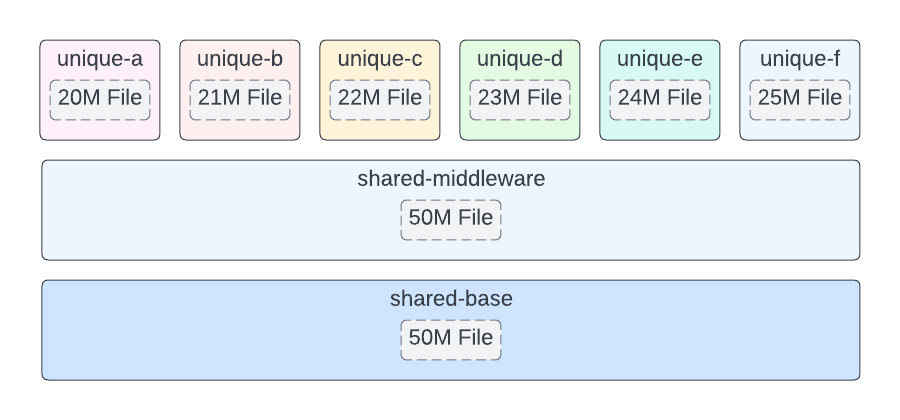

# report-podman-layers-disk-efficiency

A look into how Podman handles container layers and its disk space efficiency,
and some example scripts and containers to experiment with.

## Disk Efficiency <3 Embedded Linux

When designing software for an embedded system, disk space considerations are
typically a high priority. Embedded systems are normally constrained and there
may be only a limited amount of disk space to work with or reducing disk space
usage may save costs by allowing for cheaper hardware to be used.

This report looks at how Podman stores container images and the efficiency of
sharing [container image layers][1] between different container images.

## Test Container Images

In the subdirectory, "example-container-images", I have defined a set of
container images that are built in a three layer hierarchy.



The top level are the "unqiue" containers which each are expected to be run on
the system. These container images each contain a unique file of varying size
(20M to 25M). They are built on top of the shared-middleware container which
provides a 50M file that needs to be shared among each unique container. This
shared-middleware container is built on top of the shared-base container image
which is the base image for all the unique containers and contains an additional
50M file.

Some scripts are provided to automate the experiments:

- build.sh automates the building of the container images using Podman.

- push.sh automates the pushing of the container images to my GitHub container
  registry (not intended for general use).

- run.sh can be used to pull the container images from the GitHub container
  registry and run the containers and show the disk usage of the Podman
  container storage.

## Test Methodology

Before execution, I run `podman system reset` to clear all the local Podman
stored data including container images and containers.

I then execute `run.sh` which downloads the `unique-*` containers from my GitHub
container registry and then executes two containers per unique container image.

During run.sh, `du -sh` is executed to display the disk usage at the different
stages of `run.sh`. Specifically examining the overlay subdirectory of the
Podman containers storage directory,
`$HOME/.local/share/containers/storage/overlay`.

*This storage directory path is defined in `/etc/containers/storage.conf`.*

A quick peek at execution on my machine:

[](https://asciinema.org/a/547805)

## The Results

We can see that after pulling the container images down from the GitHub
container registry, the different layers show up in different folders. The 50M
files only show up in two overlay directories, while the other overlay
directories only have the unique files (20M-25M in size). This shows that the
different unique containers don't duplicate the shared contents between them.

```
-- Images Pulled:
36K     /home/michael/.local/share/containers/storage/overlay/l
21M     /home/michael/.local/share/containers/storage/overlay/4409c3e239a74db8e445faa597d236b4d4ebb5749278cc6a2d4e7feaadd9f2f8
22M     /home/michael/.local/share/containers/storage/overlay/902a97878032f1378470c7f4696c26dcb0f26ccd96dc8e9c2ad05d2da9eafc74
23M     /home/michael/.local/share/containers/storage/overlay/bfb89f36b788206f86879fb168bc2a114d76b39ae68ea70666ca197f33d29656
24M     /home/michael/.local/share/containers/storage/overlay/7a271446c4207b425f2f618b4ea3dbbdcef9d457481a4bb4221866cc0c8592d7
25M     /home/michael/.local/share/containers/storage/overlay/118cf006d939ff4808017f8b5803b1d29a623660d46f9374e74b7a725a34dd3a
26M     /home/michael/.local/share/containers/storage/overlay/3b9ee5c100b61b6764476072f932a66cd5427720acfd54824fef147158ef07d3
51M     /home/michael/.local/share/containers/storage/overlay/5dcd5fcee2dedce64ec3ed77c6b1f48d00cef79ad9aa1d961ae3fff62b4bdb60
51M     /home/michael/.local/share/containers/storage/overlay/c605560ea76721a4bd356fd6ecd4604a305ae52366c830a79b6f98eb507e591f
196M    /home/michael/.local/share/containers/storage/overlay/ab03326cd6b0316148039cc3533a48126b41675046011565f840e042caab0cbf
```

We can see that when we are executing the containers, additional directories
appear that show an additional overlay per running container.

```
-- Containers Running:
8.0K    /home/michael/.local/share/containers/storage/overlay/16cc7b40c2d3c5854e406704c559c22a7c5728c4053ed3739479f7a2f0bb5714
8.0K    /home/michael/.local/share/containers/storage/overlay/24fc8ba5ec83ea2db1096dfada9a64a24b7956d0eed783cd60d2ef8efb9cb184
8.0K    /home/michael/.local/share/containers/storage/overlay/25ccedac43d27991a0a16f62cf8712b6c9fd4d76438a4f1ff3f416d69e2d6343
8.0K    /home/michael/.local/share/containers/storage/overlay/2daf50e46472033df7c2c51dd69e05e3bbfcd0335f672db1146bc9a7c4d9b8ef
8.0K    /home/michael/.local/share/containers/storage/overlay/2e6da49fdb88c9805369035b704e2ae52523de1023871596b0bd84308add1c87
8.0K    /home/michael/.local/share/containers/storage/overlay/3ac05afcd1bc9ac573261107dd48da8b484d63dcb532b4159740d00d2be53982
8.0K    /home/michael/.local/share/containers/storage/overlay/441deaf920c63b50639a907ff7f945456bac1e545083806ae74bd50a965b1cf6
8.0K    /home/michael/.local/share/containers/storage/overlay/6b3a58011db2dab937a8345375258baa90503ded247a4cfa750a3dfdc5ebb4d1
8.0K    /home/michael/.local/share/containers/storage/overlay/7eb1475dc61a7f9b1b3bd77cd3d3059f8fa0fe91c64d162ed2d1a0867f0ecc75
8.0K    /home/michael/.local/share/containers/storage/overlay/8f5295d585eb45cfe768c7ce69611b0edf826a6d925dde4863fef44e4c7d40a0
8.0K    /home/michael/.local/share/containers/storage/overlay/d9c927815694b49afeb7455e2f94403713c0684566fb96269cdcd16aa6b10b68
8.0K    /home/michael/.local/share/containers/storage/overlay/fd61e7ac55f6abd1c2885f5f373629236c306d50597103d1cceb0cf09d4b1240
84K     /home/michael/.local/share/containers/storage/overlay/l
21M     /home/michael/.local/share/containers/storage/overlay/4409c3e239a74db8e445faa597d236b4d4ebb5749278cc6a2d4e7feaadd9f2f8
22M     /home/michael/.local/share/containers/storage/overlay/902a97878032f1378470c7f4696c26dcb0f26ccd96dc8e9c2ad05d2da9eafc74
23M     /home/michael/.local/share/containers/storage/overlay/bfb89f36b788206f86879fb168bc2a114d76b39ae68ea70666ca197f33d29656
24M     /home/michael/.local/share/containers/storage/overlay/7a271446c4207b425f2f618b4ea3dbbdcef9d457481a4bb4221866cc0c8592d7
25M     /home/michael/.local/share/containers/storage/overlay/118cf006d939ff4808017f8b5803b1d29a623660d46f9374e74b7a725a34dd3a
26M     /home/michael/.local/share/containers/storage/overlay/3b9ee5c100b61b6764476072f932a66cd5427720acfd54824fef147158ef07d3
51M     /home/michael/.local/share/containers/storage/overlay/5dcd5fcee2dedce64ec3ed77c6b1f48d00cef79ad9aa1d961ae3fff62b4bdb60
51M     /home/michael/.local/share/containers/storage/overlay/c605560ea76721a4bd356fd6ecd4604a305ae52366c830a79b6f98eb507e591f
196M    /home/michael/.local/share/containers/storage/overlay/ab03326cd6b0316148039cc3533a48126b41675046011565f840e042caab0cbf
```

After the containers finish execution, since we ran them with the `--rm`
parameter, the overlays per running container are cleaned up.

```
-- Containers Finished:
36K     /home/michael/.local/share/containers/storage/overlay/l
21M     /home/michael/.local/share/containers/storage/overlay/4409c3e239a74db8e445faa597d236b4d4ebb5749278cc6a2d4e7feaadd9f2f8
22M     /home/michael/.local/share/containers/storage/overlay/902a97878032f1378470c7f4696c26dcb0f26ccd96dc8e9c2ad05d2da9eafc74
23M     /home/michael/.local/share/containers/storage/overlay/bfb89f36b788206f86879fb168bc2a114d76b39ae68ea70666ca197f33d29656
24M     /home/michael/.local/share/containers/storage/overlay/7a271446c4207b425f2f618b4ea3dbbdcef9d457481a4bb4221866cc0c8592d7
25M     /home/michael/.local/share/containers/storage/overlay/118cf006d939ff4808017f8b5803b1d29a623660d46f9374e74b7a725a34dd3a
26M     /home/michael/.local/share/containers/storage/overlay/3b9ee5c100b61b6764476072f932a66cd5427720acfd54824fef147158ef07d3
51M     /home/michael/.local/share/containers/storage/overlay/5dcd5fcee2dedce64ec3ed77c6b1f48d00cef79ad9aa1d961ae3fff62b4bdb60
51M     /home/michael/.local/share/containers/storage/overlay/c605560ea76721a4bd356fd6ecd4604a305ae52366c830a79b6f98eb507e591f
196M    /home/michael/.local/share/containers/storage/overlay/ab03326cd6b0316148039cc3533a48126b41675046011565f840e042caab0cbf
```

## Conclusion

Sharing container image layers between multiple images allow for disk space
savings. The shared container layers are only stored once in the Podman storage
and not duplicated per container image.

If an embedded system has multiple containers running based on different
container images, it may be smart to try to share the base layers between these
container images as much as possible to reduce wasting disk space on duplicated
files.

This is all documented in the [official docker documentation][1] so you can read
more about this there.

[1]: https://docs.docker.com/storage/storagedriver/#images-and-layers
